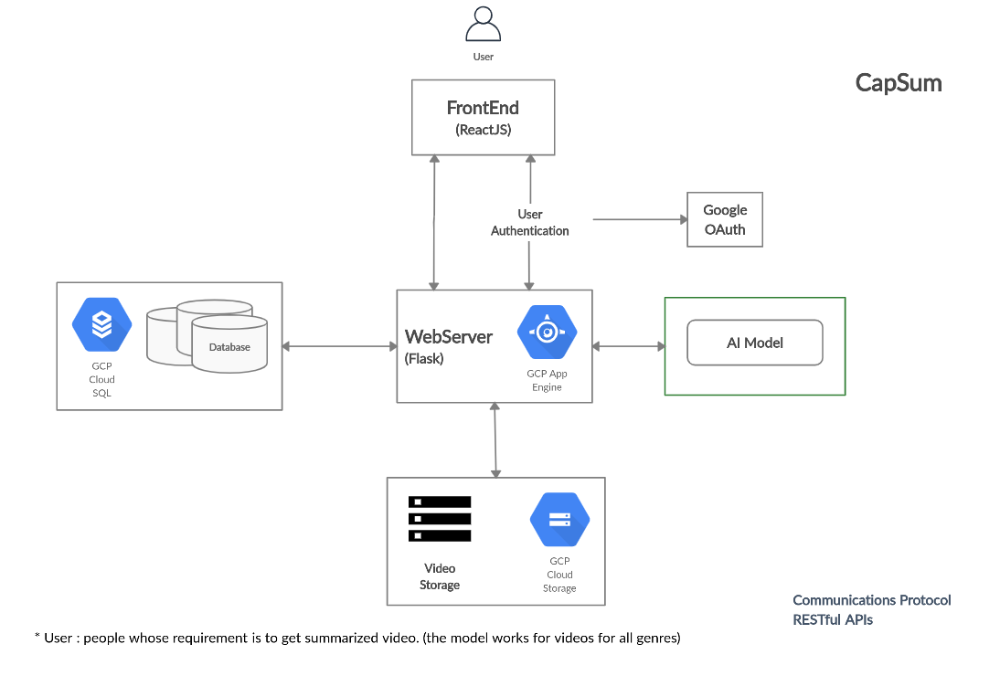
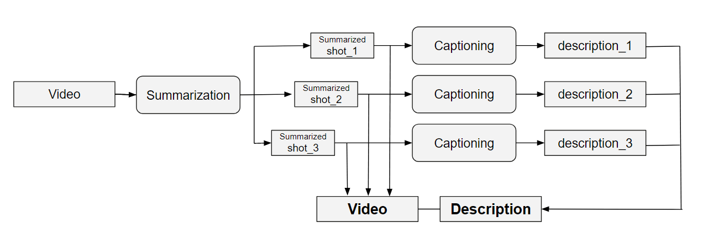
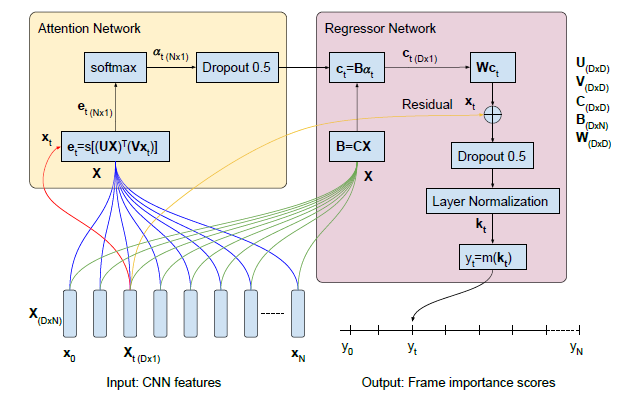
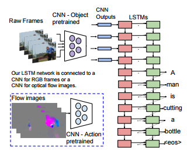

# CapSum: Joint Video Summarization and Video Captioning

## Introduction
In the present day the goal of every application is to provide a method which reduces time and provides accurate results. The idea of the project is to provide an application which combines video summarization and video captioning. The software as services which are to be provided allows user to move through the application with the option to get summarized video and view previously summarized video. The goal is to provide a summarized video along with captions added to the summarized video. The services which are provided are depended on Google Cloud Platform (GCP) for storage and database both. The application firstly saves the time by reducing video length and secondly the captions provides information in  written format. Video summarization and video captioning are considered two separate tasks in existing studies.

## Dataset
 The dataset benchmark TVSum consist of labeled keyshots video summarization, albeit still small for training deep models. The model is trained using frame-level scores, while the evaluation is performed with the binary keyshot summaries.In the augmented setting we also maintain the 5-fold cross validation with the 80/20 train/test, but add the other datasets to the training split.
  
 Microsoft Video Description Corpus, is a collection of Youtube clips which is collected on Mechanical Turk by requesting workers to pick short clips depicting a single activity. The videos were then used to elicit single sentence descriptions from annotators. Also this dataset has more than one description for individual clips. While prepossessing  there is division of the total dataset into three parts- Training, Validation and Testing as 60\%, 20\% and 20\% respectively. 

## Models

### Architecture Diagram

### CapSum

### Summarization

### Captioning

## Results
### Video Summarization

For demonstration 4 videos of resolution 854x480, frame-rate 24 and duration varying from 02:00 to 06:00 are used.

Link to the results: [Summarization Result](https://drive.google.com/drive/folders/1je3vPMB-kVpKbc4QtK9gszDVkaSlAoJv?usp=sharing)

### Video Captioning

For testing use of clips with short time duration is done. This clips contain single activities which may include more than one person. 

Link to the results: [Captioning Result](https://drive.google.com/file/d/12XJpRa643sSFYkxOjCuIzT_Pobhsu3mi/view?usp=sharing)

### CapSum (Combine)
After the summarized and captioning model is created, they are deployed. The website then receives the values of the generated which is updated for so.

Link to the results: [CapSum Demo](https://drive.google.com/file/d/1PxQA_Ey1_bgZWG0SQjf05FS9spL5uVNB/view?usp=sharing)

## Conclusions
After applying these models, for captioning we have been able to generate results which provided near accurate results. Whereas for summarization the reduction of frames was desirable in terms of providing the frames of high importance. 

## Reference
1. Y. Song, J. Vallmitjana, A. Stent, and A. Jaimes, “Tvsum: Summarizingweb  videos  using  titles,”  inProceedings of the IEEE conference oncomputer vision and pattern recognition, 2015, pp. 5179–5187.
2. D. Chen and W. B. Dolan, “Collecting highly parallel data for paraphraseevaluation,”  inProceedings of the 49th Annual Meeting of the Associ-ation for Computational Linguistics: Human Language Technologies,2011, pp. 190–200.
3. J. Fajtl,  H.  Sokeh,  V.  Argyriou,  D.  Monekosso,  and  P.  Remagnino,“Summarizing videos with attention,” 12 2018.
4. S. Venugopalan, M. Rohrbach, J. Donahue, R. Mooney, T. Darrell, andK.  Saenko,  “Sequence  to  sequence-video  to  text,”  inProceedings ofthe IEEE international conference on computer vision, 2015, pp. 4534–4542.
